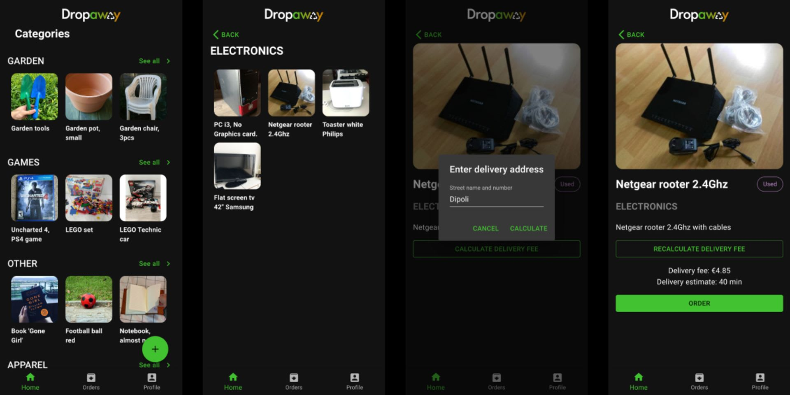

# Dropaway
## Junction 2022 project 
### 🥉 in Wolt challenge

#### Dropaway makes it possible to give and get free stuff. Delivered to you – quickly, reliably, and affordably.

There is an abundance of listings online where people are giving stuff away for free without any handy ways to deliver it.

Imagine if you are moving out and find that several items are no longer needed, what is the most convenient and conscious decision to be made? If giving this item a second life to someone else becomes more convenient than just throwing it away it is a no-brainer.

What are the options currently? For example, listings of free items are residing on the Facebook marketplace. In order to give away an item you must communicate with multiple people at once, arrange a pickup time, and meet in person and overall, it feels like a lot of hassle for something you are giving away for free. Therefore the involvement of 3rd party to handle pick-up, delivery and communication will make the whole process seamless.

The solution to all these issues is Dropaway – an app that makes it possible to give and get free stuff. Delivered to you – quickly, reliably, and affordably.  
Service is provided at no additional costs to encourage giving. Besides the practical benefit of convenience, such action will result in waste reduction, especially e-waste.

### How does it work?

If you have an item to give away for free, list it on Dropaway. When someone decides to take your item, Wolt courier will arrive to pick it up. Delivery costs are passed to the recipient.

If you want to receive an item from Dropaway. Check available listings. Select the item you want. Get it delivered by Wolt. Delivery costs are on you.

Dropaway is just a first step but an important one to test a Wolt driver network for P2P deliveries without involving complicated item pricing, returns, and other legal requirements. User feedback that will be gathered can shape a look for P2P deliveries. In the future, Dropaway can be used as a marketplace for physical goods or time-limited item leasing.

[App Demo](https://dropaway.netlify.app/)

#### App screens:

**Technologies we used:**

    Python, Javascript, Django, React, PostgreSQL, Figma, Google Cloud Services
